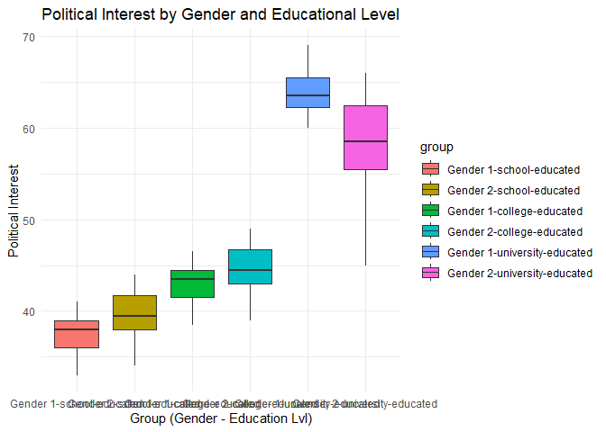

Exploring the Influence of Gender and Education Levels on Political
Interest
================

## Introduction

A study was conducted to explore whether people’s political interest is
influenced by their gender and education level. Fifty-eight participants
were selected, and their gender, education level, and political interest
were recorded. There are two levels for gender (male and female) and
three levels for education level (school-educated, college-educated, and
university-educated).

## Data Summary

``` r
# Loading Packages
suppressMessages(library(tidyverse))
library(tidyverse)
suppressMessages(library(readr))
library(readr)
suppressMessages(library(car))
library(car)
suppressMessages(library(Hmisc))
library(Hmisc)
library(dplyr)
library(knitr)

# Reading the csv file
politicalInterest <- read_csv("Political Interest.csv", show_col_types = FALSE)

# Data Table
result <- politicalInterest %>%
  group_by(gender, education_level) %>%
  summarise(political_interest = paste(political_interest, collapse = ", "), .groups = 'drop')

kable(result)
```

| gender | education_level | political_interest                               |
|-------:|----------------:|:-------------------------------------------------|
|      1 |               1 | 38, 39, 35, 38, 41, 40, 36, 37, 33               |
|      1 |               2 | 41.5, 41.5, 44.5, 44.5, 44, 46.5, 42, 43.5, 38.5 |
|      1 |               3 | 63, 64, 61, 64, 69, 69, 66, 62, 63, 60           |
|      2 |               1 | 40, 41, 36, 39, 44, 44, 42, 38, 38, 34           |
|      2 |               2 | 45, 46, 41, 44, 49, 49, 47, 43, 43, 39           |
|      2 |               3 | 57, 58, 63, 66, 65, 61, 59, 55, 45, 51           |

In this study, we have three variables: two independent and one
dependent. The variables are as follows:

#### Gender (Independent Variable)

``` r
politicalInterest$gender
```

    ##  [1] 1 1 1 1 1 1 1 1 1 1 1 1 1 1 1 1 1 1 1 1 1 1 1 1 1 1 1 1 2 2 2 2 2 2 2 2 2 2
    ## [39] 2 2 2 2 2 2 2 2 2 2 2 2 2 2 2 2 2 2 2 2

The dataset shown above is the `Gender` variable, which is one of the
independent variables in the study. As indicated by its name, it
contains the gender of each participant, recorded as either 1 or 2 (male
or female).

#### Education Level (Independent Variable)

``` r
politicalInterest$education_level
```

    ##  [1] 1 1 1 1 1 1 1 1 1 2 2 2 2 2 2 2 2 2 3 3 3 3 3 3 3 3 3 3 1 1 1 1 1 1 1 1 1 1
    ## [39] 2 2 2 2 2 2 2 2 2 2 3 3 3 3 3 3 3 3 3 3

The dataset shown above is the `Education Level` variable, which is one
of the independent variables in the study. As indicated by its name, it
contains the education level of each participant, recorded as either 1,
2, or 3 (school-educated, college-educated, or university-educated)

#### Political Interest (Dependent Variable)

``` r
politicalInterest$political_interest
```

    ##  [1] 38.0 39.0 35.0 38.0 41.0 40.0 36.0 37.0 33.0 41.5 41.5 44.5 44.5 44.0 46.5
    ## [16] 42.0 43.5 38.5 63.0 64.0 61.0 64.0 69.0 69.0 66.0 62.0 63.0 60.0 40.0 41.0
    ## [31] 36.0 39.0 44.0 44.0 42.0 38.0 38.0 34.0 45.0 46.0 41.0 44.0 49.0 49.0 47.0
    ## [46] 43.0 43.0 39.0 57.0 58.0 63.0 66.0 65.0 61.0 59.0 55.0 45.0 51.0

The dataset shown above is the `Political Interest` variable, which is
one of the dependent variables in the study. As indicated by its name,
it contains the level of political interest of each participant,
recorded on an interval scale ranging from 1 to 100.

#### Converting the Independent Variables to Factors

``` r
str(politicalInterest)
```

    ## spc_tbl_ [58 × 3] (S3: spec_tbl_df/tbl_df/tbl/data.frame)
    ##  $ gender            : num [1:58] 1 1 1 1 1 1 1 1 1 1 ...
    ##  $ education_level   : num [1:58] 1 1 1 1 1 1 1 1 1 2 ...
    ##  $ political_interest: num [1:58] 38 39 35 38 41 40 36 37 33 41.5 ...
    ##  - attr(*, "spec")=
    ##   .. cols(
    ##   ..   gender = col_double(),
    ##   ..   education_level = col_double(),
    ##   ..   political_interest = col_double()
    ##   .. )
    ##  - attr(*, "problems")=<externalptr>

``` r
# Convert 'gender' and 'education_level' to factors
politicalInterest$gender <- factor(politicalInterest$gender, levels = c(1, 2), labels = c("Gender 1", "Gender 2"))
politicalInterest$education_level <- factor(politicalInterest$education_level, levels = c(1, 2, 3), labels = c("school-educated", "college-educated", "university-educated"))

# Check the structure again to ensure the conversion worked
str(politicalInterest)
```

    ## spc_tbl_ [58 × 3] (S3: spec_tbl_df/tbl_df/tbl/data.frame)
    ##  $ gender            : Factor w/ 2 levels "Gender 1","Gender 2": 1 1 1 1 1 1 1 1 1 1 ...
    ##  $ education_level   : Factor w/ 3 levels "school-educated",..: 1 1 1 1 1 1 1 1 1 2 ...
    ##  $ political_interest: num [1:58] 38 39 35 38 41 40 36 37 33 41.5 ...
    ##  - attr(*, "spec")=
    ##   .. cols(
    ##   ..   gender = col_double(),
    ##   ..   education_level = col_double(),
    ##   ..   political_interest = col_double()
    ##   .. )
    ##  - attr(*, "problems")=<externalptr>

## Hypotheses

#### Null Hypotheses:

- $H_0$: There is no significant difference between the groups of the
  first factor.
- $H_0$: There is no significant difference between the groups of the
  second factor.
- $H_0$: There is no significant interaction effect on political
  interest between gender and education level.

#### Alternative Hypotheses:

- $H_1$: There is a significant difference between the groups of the
  first factor.
- $H_1$: There is a significant difference between the groups of the
  second factor.
- $H_1$: There is a significant interaction effect on political interest
  between gender and education level.

## Methodology

**Statistical Treatment:** Two-Way Analysis Of Variance (ANOVA)

**Rationale:**

1.  **Two Independent Variables (Factors)**
    - The study contains two independent variables or factors:
      - Gender (2 levels: Male or Female)
      - Education Level (3 levels: school-educated, college-educated, or
        university-educated)
    - The purpose of Two-Way ANOVA is to determine the main effects of
      each of these two factors (gender and education level) on the
      dependent variable (political interest), as well as any
      interaction effect between the two factors.
2.  **Main Effects of Education Level and Gender**
    - The study aims to understand how each independent variable affects
      political interest. Specifically, we want to examine:
      - Does gender (male or female) significantly affect political
        interest?
      - Does education level (e.g., school-educated, college-educated,
        university-educated) significantly influence political interest?
    - Each of these factors might have an individual (main) effect on
      political interest, and Two-Way ANOVA is designed to test these
      effects simultaneously.
3.  **Interaction Between Education Level and Gender**
    - One of the key advantages of using Two-Way ANOVA is its ability to
      test for interaction effects. In the case of this study, we are
      interested in whether the relationship between education level and
      political interest differs depending on gender.
      - For example, the impact of being university-educated on
        political interest might be different for males compared to
        females.
    - A Two-Way ANOVA tests whether the effect of education level on
      political interest is the same across gender or whether there’s a
      significant interaction—meaning the combination of gender and
      education level produces an effect on political interest that is
      not simply the sum of the individual main effects.

## Checking the Assumptions

1.  **A dependent continuous variable**

``` r
class(politicalInterest$political_interest)
```

    ## [1] "numeric"

``` r
typeof(politicalInterest$political_interest)
```

    ## [1] "double"

It is concluded that the dependent variable, which is the
`Political Interest`, is a continuous variable since its data types are
numeric and double. Hence, it satisfies the assumption that one variable
in the study is a dependent continuous variable.

2.  **Two independent variables with at least 2 levels**

``` r
# Gender Variable
gender_levels <- unique(politicalInterest$gender)
unique_gender_levels_str <- paste(gender_levels, collapse = ", ")
sentence <- paste("Gender Levels:", unique_gender_levels_str)
print(sentence)
```

    ## [1] "Gender Levels: Gender 1, Gender 2"

``` r
# Education Level Variable
educ_levels <- unique(politicalInterest$education_level)
unique_educ_levels_str <- paste(educ_levels, collapse = ", ")
sentence <- paste("Education Levels:", unique_educ_levels_str)
print(sentence)
```

    ## [1] "Education Levels: school-educated, college-educated, university-educated"

The `Gender` variable has two levels and the `Education Level` variable
has three levels. Therefore, the independent variables have at least 2
levels

3.  **Independence of observation**
    - Based on the given data it was assumed to have independent
      observations. Thus, the assumption for independent observations
      are satisfied.
4.  **No significant outliers**

``` r
politicalInterest$group = interaction(politicalInterest$gender,politicalInterest$education_level,sep="-")
ggplot(politicalInterest, aes(x = group, y = political_interest, fill = group))+
  geom_boxplot()+
  theme_minimal()+
  labs(
    title = "Political Interest by Gender and Educational Level",
    x = "Group (Gender - Education Lvl)",
    y = "Political Interest"
  )
```

<!-- -->

As shown in the graph above, there are no significant outliers for any
group interactions. Therefore, the assumption of no significant outliers
is satisfied.

5.  **Approximately normal distribution**

``` r
ShapiroWilkTest <- politicalInterest %>%
  group_by(group) %>%
  summarise(
    shapiro_statistic = shapiro.test(political_interest)$statistic,
    shapiro_pValue = shapiro.test(political_interest)$p.value
  )
kable(ShapiroWilkTest)
```

| group                        | shapiro_statistic | shapiro_pValue |
|:-----------------------------|------------------:|---------------:|
| Gender 1-school-educated     |         0.9813390 |      0.9708070 |
| Gender 2-school-educated     |         0.9629531 |      0.8189494 |
| Gender 1-college-educated    |         0.9565020 |      0.7610941 |
| Gender 2-college-educated    |         0.9629531 |      0.8189494 |
| Gender 1-university-educated |         0.9153413 |      0.3197307 |
| Gender 2-university-educated |         0.9499897 |      0.6683785 |

Based on the given p-values, the data appears to be relatively normally
distributed. Therefore, the assumption of normality is satisfied.

6.  **Homogeneity of Variances**

``` r
LeveneTest <- politicalInterest %>%
  group_by(group) %>%
  reframe(
    leveneStatistic = leveneTest(political_interest ~ group, data = .)$`F value`,
    levene_pValue = leveneTest(political_interest ~ group, data = .)$`Pr(>F)`
  )
kable(LeveneTest)
```

| group                        | leveneStatistic | levene_pValue |
|:-----------------------------|----------------:|--------------:|
| Gender 1-school-educated     |        2.205361 |     0.0676496 |
| Gender 1-school-educated     |              NA |            NA |
| Gender 2-school-educated     |        2.205361 |     0.0676496 |
| Gender 2-school-educated     |              NA |            NA |
| Gender 1-college-educated    |        2.205361 |     0.0676496 |
| Gender 1-college-educated    |              NA |            NA |
| Gender 2-college-educated    |        2.205361 |     0.0676496 |
| Gender 2-college-educated    |              NA |            NA |
| Gender 1-university-educated |        2.205361 |     0.0676496 |
| Gender 1-university-educated |              NA |            NA |
| Gender 2-university-educated |        2.205361 |     0.0676496 |
| Gender 2-university-educated |              NA |            NA |

Based on the p-values greater than 0.05 from Levene’s test for each
group, we can conclude that the variances of the dependent variable are
equal across all groups. Therefore, the assumption of homogeneity of
variance is satisfied.

## Analysis

#### Descriptive Statistics of the Data

``` r
kable(summary(politicalInterest))
```

|     | gender      | education_level        | political_interest | group                           |
|:----|:------------|:-----------------------|:-------------------|:--------------------------------|
|     | Gender 1:28 | school-educated :19    | Min. :33.00        | Gender 1-school-educated : 9    |
|     | Gender 2:30 | college-educated :19   | 1st Qu.:40.00      | Gender 2-school-educated :10    |
|     | NA          | university-educated:20 | Median :44.00      | Gender 1-college-educated : 9   |
|     | NA          | NA                     | Mean :48.04        | Gender 2-college-educated :10   |
|     | NA          | NA                     | 3rd Qu.:58.75      | Gender 1-university-educated:10 |
|     | NA          | NA                     | Max. :69.00        | Gender 2-university-educated:10 |

``` r
summaryStatsEducLvl <- politicalInterest %>% 
  group_by(education_level) %>% 
  summarise(
    count = n(),
    mean = mean(political_interest),
    sd = sd(political_interest),
  )

summaryStatsGender <- politicalInterest %>% 
  group_by(gender) %>% 
  summarise(
    count = n(),
    mean = mean(political_interest),
    sd = sd(political_interest),
  )

summaryStatsInteraction <- politicalInterest %>% 
  group_by(group) %>% 
  summarise(
    count = n(),
    mean = mean(political_interest),
    sd = sd(political_interest),
  )
```

#### Performing Two-Way ANOVA to Analyze the Data

``` r
# Remove group interaction
politicalInterest <- select(politicalInterest, -group)

# Performing Two-Way ANOVA
anova_result <- aov(political_interest ~ gender * education_level, data = politicalInterest)
# ANOVA result summary
anova_summary <- summary(anova_result)[[1]]
# Create a prettier table with kable
kable(anova_summary, format = "markdown", caption = "ANOVA Results for Political Interest")
```

|                        |  Df |     Sum Sq |    Mean Sq |    F value |   Pr(\>F) |
|:-----------------------|----:|-----------:|-----------:|-----------:|----------:|
| gender                 |   1 |   25.70117 |   25.70117 |   1.787562 | 0.1870433 |
| education_level        |   2 | 5409.95897 | 2704.97948 | 188.136131 | 0.0000000 |
| gender:education_level |   2 |  210.33766 |  105.16883 |   7.314679 | 0.0015877 |
| Residuals              |  52 |  747.64444 |   14.37778 |         NA |        NA |

ANOVA Results for Political Interest

#### Two-Way ANOVA Key Interpretations:

1.  **Main Effect of Gender**
    - With a **p-value = 0.18704**, the analysis indicates that there is
      **no statistically significant main effect of gender on political
      interest**. This suggests that gender does not account for
      substantial variability in political interest within the sample.
      Therefore, political interest appears to be relatively consistent
      across male and female participants in this study.
2.  **Main Effect of Education Level:**
    - With a **p-value \< $2x10^{-16}$**, the analysis indicates a
      **statistically significant effect of education level on political
      interest**. This suggests that individuals with different levels
      of education (e.g., school-educated, college-educated, and
      university-educated) exhibit significantly different levels of
      political interest. Therefore, education level appears to be a
      strong predictor of political interest.
3.  **Interaction Effect Between Gender and Education Level:**
    - With a **p-value = 0.00159**, the analysis suggests a
      **statistically significant interaction between gender and
      education level**. This indicates that the effect of education
      level on political interest may vary depending on gender. For
      example, the difference in political interest between
      school-educated and college-educated individuals might be more
      pronounced for one gender compared to the other.

#### Performing Tukey’s HSD (Honestly Significant Difference) Test

``` r
# Perform Tukey's HSD test for Education Level
tukey_education <- TukeyHSD(anova_result, "education_level")
tukey_df <- as.data.frame(tukey_education$education_level)
kable(tukey_df, format = "markdown", caption = "Tukey HSD Pairwise Comparisons for Education Level")
```

|                                      |      diff |      lwr |       upr |    p adj |
|:-------------------------------------|----------:|---------:|----------:|---------:|
| college-educated-school-educated     |  5.236842 |  2.26881 |  8.204874 | 0.000253 |
| university-educated-school-educated  | 22.435996 | 19.50530 | 25.366693 | 0.000000 |
| university-educated-college-educated | 17.199154 | 14.26846 | 20.129851 | 0.000000 |

Tukey HSD Pairwise Comparisons for Education Level

#### Tukey’s HSD Test Key Interpretations for Education Level:

1.  **College-educated vs. School-educated:**
    - The mean political interest score is significantly higher for
      **college-educated** individuals compared to **school-educated**
      individuals, with a mean difference of **5.24**. The confidence
      interval is between **2.27 and 8.20**, so we are confident that
      the true mean difference lies in this range.
2.  **University-educated vs. School-educated:**
    - The mean political interest score is significantly higher for
      **university-educated** individuals compared to
      **school-educated** individuals, with a much larger mean
      difference of **22.44**. The confidence interval is between
      **19.51 and 25.37**, suggesting a strong and consistent effect
      across the population.
3.  **university-educated vs. college-educated:**
    - The mean political interest score is also significantly higher for
      **university-educated** individuals compared to
      **college-educated** individuals, with a mean difference of
      **17.20**. The confidence interval is between **14.27 and 20.13**,
      again showing a robust effect.

#### Performing Tukey’s HSD (Honestly Significant Difference) Test

``` r
# Tukey's HSD test for the interaction (Gender × Education Level)
tukey_interaction <- TukeyHSD(anova_result, "gender:education_level")
tukey_interaction_df <- as.data.frame(tukey_interaction$`gender:education_level`)
kable(tukey_interaction_df, format = "markdown", caption = "Tukey HSD Pairwise Comparisons for Gender and Education Level")
```

|                                                           |      diff |         lwr |       upr |     p adj |
|:----------------------------------------------------------|----------:|------------:|----------:|----------:|
| Gender 2:school-educated-Gender 1:school-educated         |  2.155556 |  -2.9989575 |  7.310069 | 0.8165366 |
| Gender 1:college-educated-Gender 1:school-educated        |  5.500000 |   0.2115812 | 10.788419 | 0.0370678 |
| Gender 2:college-educated-Gender 1:school-educated        |  7.155556 |   2.0010425 | 12.310069 | 0.0018818 |
| Gender 1:university-educated-Gender 1:school-educated     | 26.655556 |  21.5010425 | 31.810069 | 0.0000000 |
| Gender 2:university-educated-Gender 1:school-educated     | 20.555556 |  15.4010425 | 25.710069 | 0.0000000 |
| Gender 1:college-educated-Gender 2:school-educated        |  3.344444 |  -1.8100686 |  8.498957 | 0.4021433 |
| Gender 2:college-educated-Gender 2:school-educated        |  5.000000 |  -0.0170346 | 10.017035 | 0.0512608 |
| Gender 1:university-educated-Gender 2:school-educated     | 24.500000 |  19.4829654 | 29.517035 | 0.0000000 |
| Gender 2:university-educated-Gender 2:school-educated     | 18.400000 |  13.3829654 | 23.417035 | 0.0000000 |
| Gender 2:college-educated-Gender 1:college-educated       |  1.655556 |  -3.4989575 |  6.810069 | 0.9312003 |
| Gender 1:university-educated-Gender 1:college-educated    | 21.155556 |  16.0010425 | 26.310069 | 0.0000000 |
| Gender 2:university-educated-Gender 1:college-educated    | 15.055556 |   9.9010425 | 20.210069 | 0.0000000 |
| Gender 1:university-educated-Gender 2:college-educated    | 19.500000 |  14.4829654 | 24.517035 | 0.0000000 |
| Gender 2:university-educated-Gender 2:college-educated    | 13.400000 |   8.3829654 | 18.417035 | 0.0000000 |
| Gender 2:university-educated-Gender 1:university-educated | -6.100000 | -11.1170346 | -1.082965 | 0.0088708 |

Tukey HSD Pairwise Comparisons for Gender and Education Level

#### Tukey’s HSD Test Key Interpretations between Gender and Education Level:

1.  **Gender 2: school-educated vs. Gender 1: school-educated**
    - There is no statistically significant difference in political
      interest between Gender 1 (school-educated) and Gender 2
      (school-educated). The p-value is 0.8165, which is much greater
      than 0.05, so we fail to reject the null hypothesis and conclude
      that there is no significant difference between the two groups.
2.  **Gender 1: college-educated vs. Gender 1: school-educated**
    - There is a **statistically significant difference** between Gender
      1 (college-educated) and Gender 1 (school-educated), with a mean
      difference of 5.50. Since the p-value is 0.0371 (which is less
      than 0.05), we reject the null hypothesis and conclude that there
      is a significant difference in political interest between these
      two groups.
3.  **Gender 2: college-educated vs. Gender 1: school-educated**
    - There is a statistically significant difference between Gender 2
      (college-educated) and Gender 1 (school-educated), with a mean
      difference of 7.16. The p-value is 0.0019, which is much less than
      0.05, indicating a highly significant difference in political
      interest between these groups.
4.  **Gender 1: university-educated vs. Gender 1: school-educated**
    - There is a very large and statistically significant difference
      between Gender 1 (university-educated) and Gender 1
      (school-educated), with a mean difference of 26.66. The p-value is
      0.0000, which is extremely small, indicating a highly significant
      difference in political interest between these two groups.
5.  **Gender 2: university-educated vs. Gender 1: school-educated**
    - There is a statistically significant difference between Gender 2
      (university-educated) and Gender 1 (school-educated), with a mean
      difference of 20.56. The p-value is 0.0000, indicating a highly
      significant difference in political interest.
6.  **Gender 1: college-educated vs. Gender 2: school-educated**
    - There is no significant difference between Gender 1
      (college-educated) and Gender 2 (school-educated), as the p-value
      is 0.4021, which is greater than 0.05. Therefore, we fail to
      reject the null hypothesis, suggesting that these two groups have
      similar political interest scores.
7.  **Gender 2: college-educated vs. Gender 2: school-educated**
    - This comparison is marginally significant. The mean difference is
      5.00, and the confidence interval spans zero (-0.02 to 10.02). The
      p-value is 0.0513, which is slightly greater than 0.05 but very
      close, indicating that the difference may be significant with a
      slightly relaxed threshold. This result should be interpreted
      cautiously.
8.  **Gender 1: university-educated vs. Gender 2: school-educated**
    - There is a statistically significant difference between Gender 1
      (university-educated) and Gender 2 (school-educated), with a mean
      difference of 24.50. The p-value is 0.0000, indicating a highly
      significant difference.
9.  **Gender 2: university-educated vs. Gender 2: school-educated**
    - There is a statistically significant difference between Gender 2
      (university-educated) and Gender 2 (school-educated), with a mean
      difference of 18.40. The p-value is 0.0000, indicating a highly
      significant difference.
10. **Gender 2: college-educated vs. Gender 1: college-educated** -
    There is no significant difference between Gender 2
    (college-educated) and Gender 1 (college-educated), as the p-value
    is 0.9312, which is much greater than 0.05. We fail to reject the
    null hypothesis, meaning these two groups have similar political
    interest scores.
11. **Gender 1: university-educated vs. Gender 1: college-educated** -
    There is a statistically significant difference between Gender 1
    (university-educated) and Gender 1 (college-educated), with a mean
    difference of 21.16. The p-value is 0.0000, indicating a highly
    significant difference.
12. **Gender 2: university-educated vs. Gender 1: college-educated** -
    There is a statistically significant difference between Gender 2
    (university-educated) and Gender 1 (college-educated), with a mean
    difference of 15.06. The p-value is 0.0000, indicating a highly
    significant difference.
13. **Gender 1: university-educated vs. Gender 2: college-educated** -
    There is a statistically significant difference between Gender 1
    (university-educated) and Gender 2 (college-educated), with a mean
    difference of 19.50. The p-value is 0.0000, indicating a highly
    significant difference.
14. **Gender 2: university-educated vs. Gender 2: college-educated** -
    There is a statistically significant difference between Gender 2
    (university-educated) and Gender 2 (college-educated), with a mean
    difference of 13.40. The p-value is 0.0000, indicating a highly
    significant difference.
15. **Gender 2: university-educated vs. Gender 1:
    university-educated** - There is a statistically significant
    difference between Gender 2 (university-educated) and Gender 1
    (university-educated), with a mean difference of -6.10. The negative
    value suggests that Gender 2 (university-educated) has a lower
    political interest score than Gender 1 (university-educated). The
    p-value of 0.0089 indicates a significant result.

##### Summary

- Many of the comparisons show significant differences in political
  interest between the gender-education combinations, especially between
  university-educated and school-educated individuals.
- Some comparisons show no significant differences, such as between
  Gender 2 (school-educated) and Gender 1 (school-educated) or Gender 1
  (college-educated) and Gender 2 (college-educated).
- Gender seems to interact with education level, and the
  university-educated groups generally show higher political interest
  compared to other education levels, with the Gender 2
  (university-educated) groups often showing lower political interest
  than Gender 1 (university-educated).

## Conclusion

- **Main Effect of Gender**
  - With a p-value = 0.18704, we **fail to reject the null hypothesis**
    that there is no statistically significant main effect of gender on
    political interest. Therefore, this suggests that gender does not
    influence people’s level of political interest.
- **Main Effect of Education Level:**
  - With a p-value \< $2x10^{-16}$, we **reject the null hypothesis**
    that there is no statistically significant main effect of education
    level on political interest. This means that the people’s level of
    education influences their level of political interest. Moreover,
    the study shows that individuals with a **university education**,
    regardless of gender, demonstrate the **highest level of political
    interest**. On the other hand, individuals with a **school
    education** demonstrate the **lowest level of political interest**.
- **Interaction Effect Between Gender and Education Level:**
  - With a p-value = 0.00159, we **reject the null hypothesis** that
    there is no statistically significant interaction between gender and
    education level. This means that the effect of education level on
    political interest may vary depending on gender. Moreover, the study
    shows that **Gender 1-classified individuals with a university
    education** demonstrate the **highest level of political interest**.
    On the other hand, **Gender 1-classified individuals with a school
    education** demonstrate the **lowest level of political interest**.
