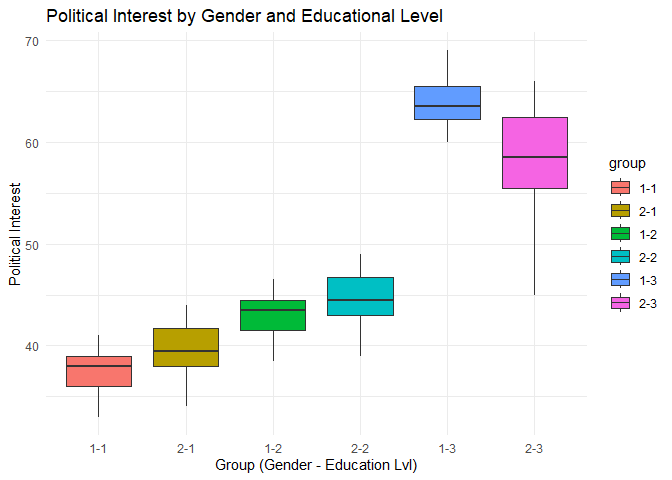

Exploring the Influence of Gender and Education Levels on Political
Interest
================

## Introduction

A study was conducted to explore whether people’s political interest is
influenced by their gender and education level. Fifty-eight participants
were selected, and their gender, education level, and political interest
were recorded.

## Data Summary

``` r
# Loading Packages
suppressMessages(library(tidyverse))
library(tidyverse)
suppressMessages(library(readr))
library(readr)
suppressMessages(library(car))
library(car)
suppressMessages(library(Hmisc))
library(Hmisc)
library(dplyr)

# Reading the csv file
politicalInterest <- read_csv("Political Interest.csv", show_col_types = FALSE)
politicalInterest
```

    ## # A tibble: 58 × 3
    ##    gender education_level political_interest
    ##     <dbl>           <dbl>              <dbl>
    ##  1      1               1               38  
    ##  2      1               1               39  
    ##  3      1               1               35  
    ##  4      1               1               38  
    ##  5      1               1               41  
    ##  6      1               1               40  
    ##  7      1               1               36  
    ##  8      1               1               37  
    ##  9      1               1               33  
    ## 10      1               2               41.5
    ## # ℹ 48 more rows

#### Gender (Independent Variable)

``` r
politicalInterest$gender
```

    ##  [1] 1 1 1 1 1 1 1 1 1 1 1 1 1 1 1 1 1 1 1 1 1 1 1 1 1 1 1 1 2 2 2 2 2 2 2 2 2 2
    ## [39] 2 2 2 2 2 2 2 2 2 2 2 2 2 2 2 2 2 2 2 2

#### Education Level (Independent Variable)

``` r
politicalInterest$education_level
```

    ##  [1] 1 1 1 1 1 1 1 1 1 2 2 2 2 2 2 2 2 2 3 3 3 3 3 3 3 3 3 3 1 1 1 1 1 1 1 1 1 1
    ## [39] 2 2 2 2 2 2 2 2 2 2 3 3 3 3 3 3 3 3 3 3

#### Political Interest (Dependent Variable)

``` r
politicalInterest$political_interest
```

    ##  [1] 38.0 39.0 35.0 38.0 41.0 40.0 36.0 37.0 33.0 41.5 41.5 44.5 44.5 44.0 46.5
    ## [16] 42.0 43.5 38.5 63.0 64.0 61.0 64.0 69.0 69.0 66.0 62.0 63.0 60.0 40.0 41.0
    ## [31] 36.0 39.0 44.0 44.0 42.0 38.0 38.0 34.0 45.0 46.0 41.0 44.0 49.0 49.0 47.0
    ## [46] 43.0 43.0 39.0 57.0 58.0 63.0 66.0 65.0 61.0 59.0 55.0 45.0 51.0

## Hypotheses

#### Null Hypotheses:

- **$H_0$:**
- **$H_0$:**
- **$H_0$:** There is no significant interaction effect on political
  interest between gender and education level.

#### Alternative Hypotheses:

- **$H_1$:**
- **$H_1$:**
- **$H_1$:** There is a significant interaction effect on political
  interest between gender and education level.

## Checking the Assumptions

1.  **A dependent continuous variable**

``` r
class(politicalInterest$political_interest)
```

    ## [1] "numeric"

``` r
typeof(politicalInterest$political_interest)
```

    ## [1] "double"

It is concluded that the dependent variable, which is the
`Political Interest`, is a continuous variable since its data types are
numeric and double.

2.  **Two independent variables with at least 2 levels**

``` r
# Gender Variable
gender_levels <- unique(politicalInterest$gender)
unique_gender_levels_str <- paste(gender_levels, collapse = ", ")
sentence <- paste("Gender Levels:", unique_gender_levels_str)
print(sentence)
```

    ## [1] "Gender Levels: 1, 2"

``` r
# Education Level Variable
educ_levels <- unique(politicalInterest$education_level)
unique_educ_levels_str <- paste(educ_levels, collapse = ", ")
sentence <- paste("Education Levels:", unique_educ_levels_str)
print(sentence)
```

    ## [1] "Education Levels: 1, 2, 3"

The `Gender` variable has two levels and the `Education Level` variable
has three levels. Therefore, the independent variables have at least 2
levels

3.  **Independence of observation**
    - Based on the given data it was assumed to have independent
      observations. Thus, the assumption for independent observations
      are satisfied.
4.  **No significant outliers**

``` r
politicalInterest$group = interaction(politicalInterest$gender,politicalInterest$education_level,sep="-")
ggplot(politicalInterest, aes(x = group, y = political_interest, fill = group))+
  geom_boxplot()+
  theme_minimal()+
  labs(
    title = "Political Interest by Gender and Educational Level",
    x = "Group (Gender - Education Lvl)",
    y = "Political Interest"
  )
```

<!-- -->

As shown in the graph above, there are no significant outliers for any
group interactions. Therefore, the assumption of no significant outliers
is satisfied.

5.  **Approximately normal distribution**

``` r
ShapiroWilkTest <- politicalInterest %>%
  group_by(group) %>%
  summarise(
    shapiro_statistic = shapiro.test(political_interest)$statistic,
    shapiro_pValue = shapiro.test(political_interest)$p.value
  )
ShapiroWilkTest
```

    ## # A tibble: 6 × 3
    ##   group shapiro_statistic shapiro_pValue
    ##   <fct>             <dbl>          <dbl>
    ## 1 1-1               0.981          0.971
    ## 2 2-1               0.963          0.819
    ## 3 1-2               0.957          0.761
    ## 4 2-2               0.963          0.819
    ## 5 1-3               0.915          0.320
    ## 6 2-3               0.950          0.668

Based on the given p-values, the data appears to be relatively normally
distributed. Therefore, the assumption of normality is satisfied.

6.  **Homogeneity of Variances**

``` r
LeveneTest <- politicalInterest %>%
  group_by(group) %>%
  reframe(
    leveneTestResult = list(leveneTest(political_interest ~ group, data = .)),
    leveneStatistic = leveneTestResult[[1]]$`F value`,
    levene_pValue = leveneTestResult[[1]]$`Pr(>F)`
  )
LeveneTest
```

    ## # A tibble: 12 × 4
    ##    group leveneTestResult leveneStatistic levene_pValue
    ##    <fct> <list>                     <dbl>         <dbl>
    ##  1 1-1   <anova [2 × 3]>             2.21        0.0676
    ##  2 1-1   <anova [2 × 3]>            NA          NA     
    ##  3 2-1   <anova [2 × 3]>             2.21        0.0676
    ##  4 2-1   <anova [2 × 3]>            NA          NA     
    ##  5 1-2   <anova [2 × 3]>             2.21        0.0676
    ##  6 1-2   <anova [2 × 3]>            NA          NA     
    ##  7 2-2   <anova [2 × 3]>             2.21        0.0676
    ##  8 2-2   <anova [2 × 3]>            NA          NA     
    ##  9 1-3   <anova [2 × 3]>             2.21        0.0676
    ## 10 1-3   <anova [2 × 3]>            NA          NA     
    ## 11 2-3   <anova [2 × 3]>             2.21        0.0676
    ## 12 2-3   <anova [2 × 3]>            NA          NA

Based on the p-values greater than 0.05 from Levene’s test for each
group, we can conclude that the variances of the dependent variable are
equal across all groups. Therefore, the assumption of homogeneity of
variance is satisfied.
